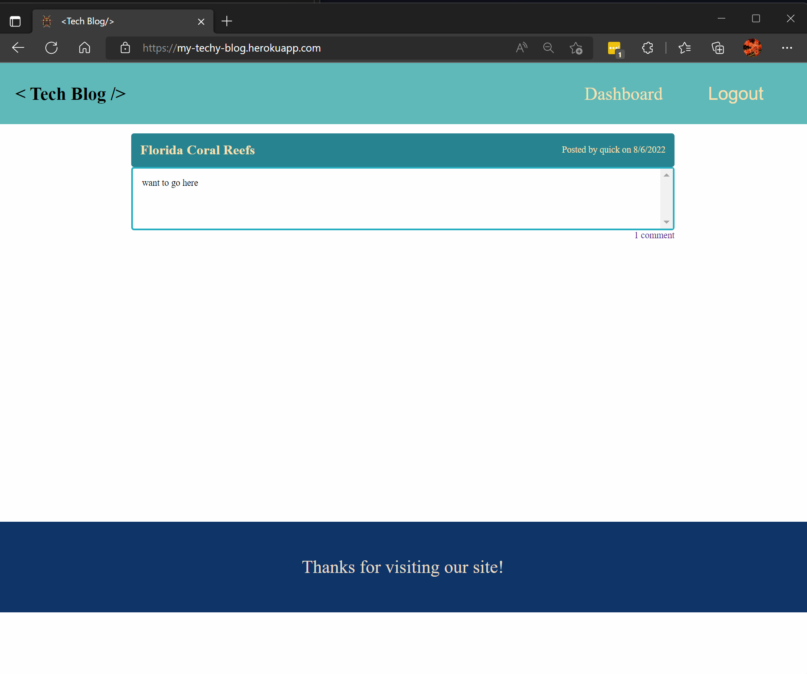
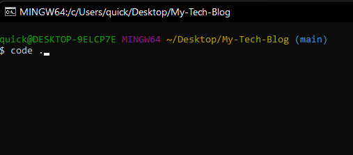

# My-Tech-Blog

## Table of Contents

- [Description](#Description)
- [Walkthrough-Video](#Walkthrough-Video)
- [Installation](#installation)
- [Usage](#usage)
- [Instructions](#instructions)
- [Website-heroku-deployment](#Website-heroku-deployment)
- [Created by](#Created-by)
- [Questions](#questions)

## Description

This is a front and backend for a blog site to share different tech ideas and expand knowledge with individuals. It is a simplistic design meant to be built upon to expand ideas and learn.

## Walkthrough-Video

https://user-images.githubusercontent.com/102430476/183257395-728df0fd-58d0-4236-b369-67c76df3f8c5.mp4

## Youtube-channel
 - [Youtube-Channel](https://youtu.be/p3OD6jkYCbM)

## Installation

In order to install this project you must clone this project on to your local machine.

## Usage

This project is developed to improve learning about all tech releated ideas and concepts through blogging.

## Instructions

- Step 1: Clone this repository

* 

- Step 2: Install dependencies with 'npm install'

* 

- Step 3: Type code .

* 

- Step 4: Create .env file

- Step 5: Add credentials using DB_NAME = 'cultural_florida_db', DB_USER, DB_PW

* 

- Step 6: Login to you mysql server and type 'source db/schema.sql

* 

## Website-heroku-deployment 
 - Step-10: You can create, edit, and delete your posts; leave comments, login, signup, and logout.
    
 # [To view my page](https://my-techy-blog.herokuapp.com/)

## Created-by

[Jeremy](https://github.com/quicksilver524) - 

## Questions

- If you have any further questions please feel free to contact us at [quicksilver524@gmail.com](quicksilver524@gmail.com)
